# Local Git repo creation

```bash
    CI_CD/gitserver$ mkdir .ssh && chmod 700 .ssh
    CI_CD/gitserver$ touch .ssh/authorized_keys && chmod 600 .ssh/authorized_keys
    CI_CD/gitserver$ cat ~/.ssh/id_rsa.pub >> .ssh/authorized_keys 
    CI_CD/gitserver$ mkdir project.git
    CI_CD/gitserver$ cd project.git
    CI_CD/gitserver/project.git$ git init --bare
    Initialized empty Git repository in CI_CD/gitserver/project.git/
```

после апдейта репозитория можно остановить docker composer с помощью Ctrl+C в терминале где он запущен, затем 

```bash
    docker compose build
    docker compose up
```

в случае ошибки связанной с настройкой сети

```bash
    docker-compose up --force-recreate --remove-orphans
```

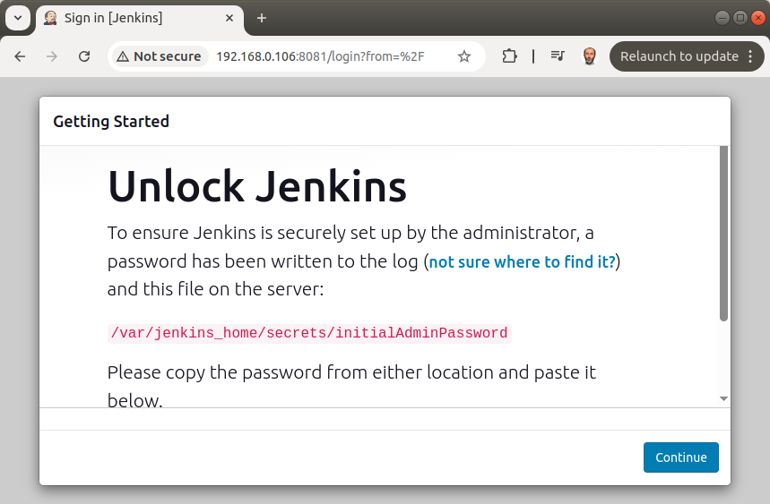

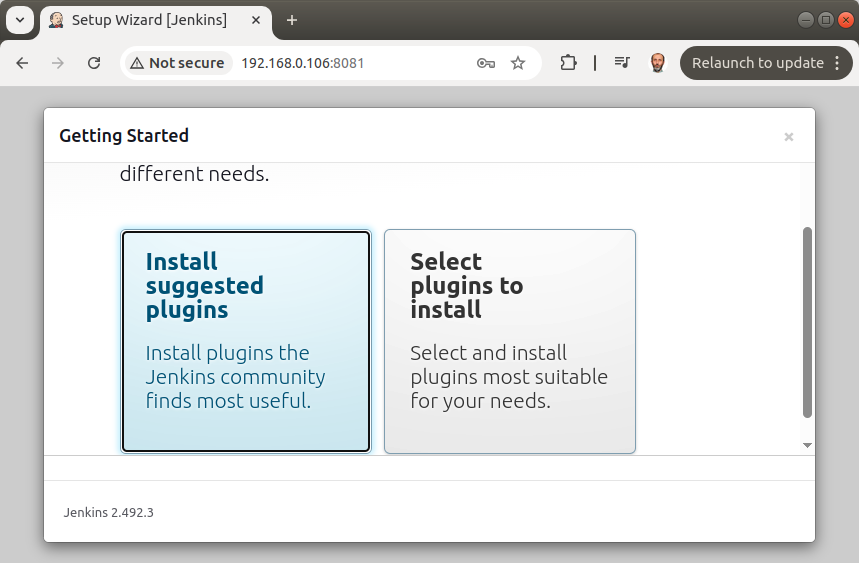

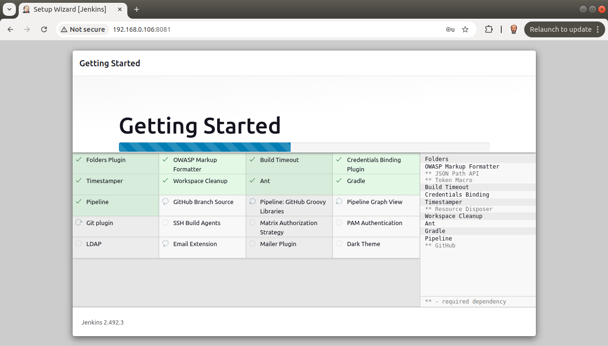

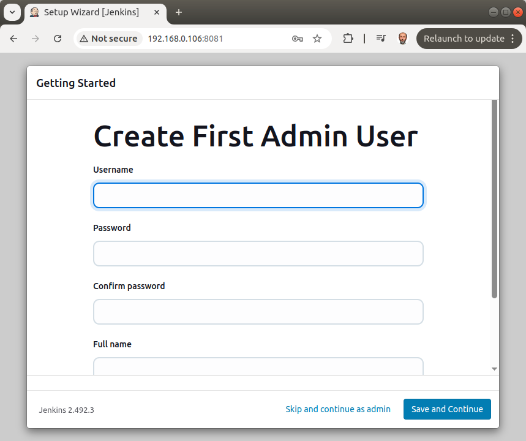

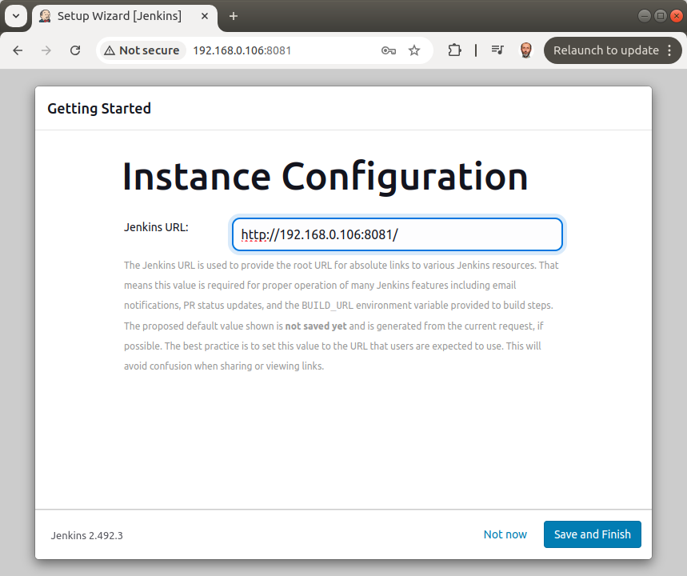

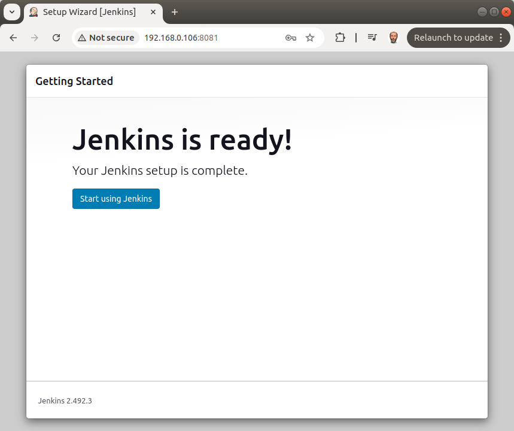

ну а после того как поднимутся все сервисы нужно запустить пайтон скрипт

```bash
    jenkins/docker$ ./exec_ssh-keyscan.py
```

# jenkins
```bash
    cd jenkins/docker

    jenkins/docker$ docker compose build
    jenkins/docker$ docker compose up
    jenkins/docker$ ./exec_ssh-keyscan.py 

    jenkins_agent IP is 172.18.0.3
    docker exec -it --workdir=/var/jenkins_home jenkins_sandbox
    Host 172.18.0.3 not found in /var/jenkins_home/.ssh/known_hosts
    docker exec -it --workdir=/root/ jenkins_sandbox
    Cannot stat /root//.ssh/known_hosts: No such file or directory
    docker exec -it --workdir=/var/jenkins_home jenkins_sandbox
    known_hosts  known_hosts.old
    docker exec -it --workdir=/var/jenkins_home jenkins_sandbox
    .ssh/known_hosts
    ['docker', 'exec', '-it', '--workdir=/var/jenkins_home', 'jenkins_sandbox', '/scan-host-key.sh', '172.18.0.3', '/var/jenkins_home']
    # 172.18.0.3:22 SSH-2.0-OpenSSH_9.2p1 Debian-2+deb12u5
    # 172.18.0.3:22 SSH-2.0-OpenSSH_9.2p1 Debian-2+deb12u5
    # 172.18.0.3:22 SSH-2.0-OpenSSH_9.2p1 Debian-2+deb12u5
    # 172.18.0.3:22 SSH-2.0-OpenSSH_9.2p1 Debian-2+deb12u5
    # 172.18.0.3:22 SSH-2.0-OpenSSH_9.2p1 Debian-2+deb12u5

    docker exec -it --workdir=/root/ jenkins_sandbox
    ls: cannot access '.ssh': No such file or directory
    docker exec -it --workdir=/root/ jenkins_sandbox
    docker exec -it --workdir=/root/ jenkins_sandbox
    ls: cannot access '.ssh/known_hosts': No such file or directory
    docker exec -it --workdir=/root/ jenkins_sandbox
    ['docker', 'exec', '-it', '--workdir=/root/', 'jenkins_sandbox', '/scan-host-key.sh', '172.18.0.3', '/root/']
    # 172.18.0.3:22 SSH-2.0-OpenSSH_9.2p1 Debian-2+deb12u5
    # 172.18.0.3:22 SSH-2.0-OpenSSH_9.2p1 Debian-2+deb12u5
    # 172.18.0.3:22 SSH-2.0-OpenSSH_9.2p1 Debian-2+deb12u5
    # 172.18.0.3:22 SSH-2.0-OpenSSH_9.2p1 Debian-2+deb12u5
    # 172.18.0.3:22 SSH-2.0-OpenSSH_9.2p1 Debian-2+deb12u5

    jenkins_agent_android IP is 172.18.0.4
    docker exec -it --workdir=/var/jenkins_home jenkins_sandbox
    Host 172.18.0.4 not found in /var/jenkins_home/.ssh/known_hosts
    docker exec -it --workdir=/root/ jenkins_sandbox
    Host 172.18.0.4 not found in /root//.ssh/known_hosts
    docker exec -it --workdir=/var/jenkins_home jenkins_sandbox
    known_hosts  known_hosts.old
    docker exec -it --workdir=/var/jenkins_home jenkins_sandbox
    .ssh/known_hosts
    ['docker', 'exec', '-it', '--workdir=/var/jenkins_home', 'jenkins_sandbox', '/scan-host-key.sh', '172.18.0.4', '/var/jenkins_home']
    # 172.18.0.4:22 SSH-2.0-OpenSSH_9.2p1 Debian-2+deb12u5
    # 172.18.0.4:22 SSH-2.0-OpenSSH_9.2p1 Debian-2+deb12u5
    # 172.18.0.4:22 SSH-2.0-OpenSSH_9.2p1 Debian-2+deb12u5
    # 172.18.0.4:22 SSH-2.0-OpenSSH_9.2p1 Debian-2+deb12u5
    # 172.18.0.4:22 SSH-2.0-OpenSSH_9.2p1 Debian-2+deb12u5

    docker exec -it --workdir=/root/ jenkins_sandbox
    known_hosts
    docker exec -it --workdir=/root/ jenkins_sandbox
    .ssh/known_hosts
    ['docker', 'exec', '-it', '--workdir=/root/', 'jenkins_sandbox', '/scan-host-key.sh', '172.18.0.4', '/root/']
    # 172.18.0.4:22 SSH-2.0-OpenSSH_9.2p1 Debian-2+deb12u5
    # 172.18.0.4:22 SSH-2.0-OpenSSH_9.2p1 Debian-2+deb12u5
    # 172.18.0.4:22 SSH-2.0-OpenSSH_9.2p1 Debian-2+deb12u5
    # 172.18.0.4:22 SSH-2.0-OpenSSH_9.2p1 Debian-2+deb12u5
    # 172.18.0.4:22 SSH-2.0-OpenSSH_9.2p1 Debian-2+deb12u5

    git_server_rockstorm IP is 172.18.0.5
    docker exec -it --workdir=/var/jenkins_home jenkins_sandbox
    Host 172.18.0.5 not found in /var/jenkins_home/.ssh/known_hosts
    docker exec -it --workdir=/root/ jenkins_sandbox
    Host 172.18.0.5 not found in /root//.ssh/known_hosts
    docker exec -it --workdir=/var/jenkins_home jenkins_sandbox
    known_hosts  known_hosts.old
    docker exec -it --workdir=/var/jenkins_home jenkins_sandbox
    .ssh/known_hosts
    ['docker', 'exec', '-it', '--workdir=/var/jenkins_home', 'jenkins_sandbox', '/scan-host-key.sh', '172.18.0.5', '/var/jenkins_home']
    # 172.18.0.5:22 SSH-2.0-OpenSSH_10.0
    # 172.18.0.5:22 SSH-2.0-OpenSSH_10.0
    # 172.18.0.5:22 SSH-2.0-OpenSSH_10.0
    # 172.18.0.5:22 SSH-2.0-OpenSSH_10.0
    # 172.18.0.5:22 SSH-2.0-OpenSSH_10.0

    docker exec -it --workdir=/root/ jenkins_sandbox
    known_hosts
    docker exec -it --workdir=/root/ jenkins_sandbox
    .ssh/known_hosts
    ['docker', 'exec', '-it', '--workdir=/root/', 'jenkins_sandbox', '/scan-host-key.sh', '172.18.0.5', '/root/']
    # 172.18.0.5:22 SSH-2.0-OpenSSH_10.0
    # 172.18.0.5:22 SSH-2.0-OpenSSH_10.0
    # 172.18.0.5:22 SSH-2.0-OpenSSH_10.0
    # 172.18.0.5:22 SSH-2.0-OpenSSH_10.0
    # 172.18.0.5:22 SSH-2.0-OpenSSH_10.0

    docker exec -it --workdir=/home/jenkins jenkins_agent
    Cannot stat /home/jenkins/.ssh/known_hosts: No such file or directory
    docker exec -it --workdir=/root/ jenkins_agent
    Cannot stat /root//.ssh/known_hosts: No such file or directory
    docker exec -it --workdir=/home/jenkins jenkins_agent
    authorized_keys
    docker exec -it --workdir=/home/jenkins jenkins_agent
    ls: cannot access '.ssh/known_hosts': No such file or directory
    docker exec -it --workdir=/home/jenkins jenkins_agent
    ['docker', 'exec', '-it', '--workdir=/home/jenkins', 'jenkins_agent', '/scan-host-key.sh', '172.18.0.5', '/home/jenkins']
    # 172.18.0.5:22 SSH-2.0-OpenSSH_10.0
    # 172.18.0.5:22 SSH-2.0-OpenSSH_10.0
    # 172.18.0.5:22 SSH-2.0-OpenSSH_10.0
    # 172.18.0.5:22 SSH-2.0-OpenSSH_10.0
    # 172.18.0.5:22 SSH-2.0-OpenSSH_10.0

    docker exec -it --workdir=/root/ jenkins_agent
    ls: cannot access '.ssh': No such file or directory
    docker exec -it --workdir=/root/ jenkins_agent
    docker exec -it --workdir=/root/ jenkins_agent
    ls: cannot access '.ssh/known_hosts': No such file or directory
    docker exec -it --workdir=/root/ jenkins_agent
    ['docker', 'exec', '-it', '--workdir=/root/', 'jenkins_agent', '/scan-host-key.sh', '172.18.0.5', '/root/']
    # 172.18.0.5:22 SSH-2.0-OpenSSH_10.0
    # 172.18.0.5:22 SSH-2.0-OpenSSH_10.0
    # 172.18.0.5:22 SSH-2.0-OpenSSH_10.0
    # 172.18.0.5:22 SSH-2.0-OpenSSH_10.0
    # 172.18.0.5:22 SSH-2.0-OpenSSH_10.0

    docker exec -it --workdir=/home/jenkins jenkins_agent_android
    Cannot stat /home/jenkins/.ssh/known_hosts: No such file or directory
    docker exec -it --workdir=/root/ jenkins_agent_android
    Cannot stat /root//.ssh/known_hosts: No such file or directory
    docker exec -it --workdir=/home/jenkins jenkins_agent_android
    authorized_keys
    docker exec -it --workdir=/home/jenkins jenkins_agent_android
    ls: cannot access '.ssh/known_hosts': No such file or directory
    docker exec -it --workdir=/home/jenkins jenkins_agent_android
    ['docker', 'exec', '-it', '--workdir=/home/jenkins', 'jenkins_agent_android', '/scan-host-key.sh', '172.18.0.5', '/home/jenkins']
    # 172.18.0.5:22 SSH-2.0-OpenSSH_10.0
    # 172.18.0.5:22 SSH-2.0-OpenSSH_10.0
    # 172.18.0.5:22 SSH-2.0-OpenSSH_10.0
    # 172.18.0.5:22 SSH-2.0-OpenSSH_10.0
    # 172.18.0.5:22 SSH-2.0-OpenSSH_10.0

    docker exec -it --workdir=/root/ jenkins_agent_android
    ls: cannot access '.ssh': No such file or directory
    docker exec -it --workdir=/root/ jenkins_agent_android
    docker exec -it --workdir=/root/ jenkins_agent_android
    ls: cannot access '.ssh/known_hosts': No such file or directory
    docker exec -it --workdir=/root/ jenkins_agent_android
    ['docker', 'exec', '-it', '--workdir=/root/', 'jenkins_agent_android', '/scan-host-key.sh', '172.18.0.5', '/root/']
    # 172.18.0.5:22 SSH-2.0-OpenSSH_10.0
    # 172.18.0.5:22 SSH-2.0-OpenSSH_10.0
    # 172.18.0.5:22 SSH-2.0-OpenSSH_10.0
    # 172.18.0.5:22 SSH-2.0-OpenSSH_10.0
    # 172.18.0.5:22 SSH-2.0-OpenSSH_10.0

```


из логов пайтон скрипта нужно узнать айпишники ssh-agent, ssh-agent-android и гитсервера

```bash
    jenkins_agent IP is 172.18.0.3
    jenkins_agent_android IP is 172.18.0.4
    git_server_rockstorm IP is 172.18.0.5
```

Эти айпишники нужно использовать при конфигурации нодов

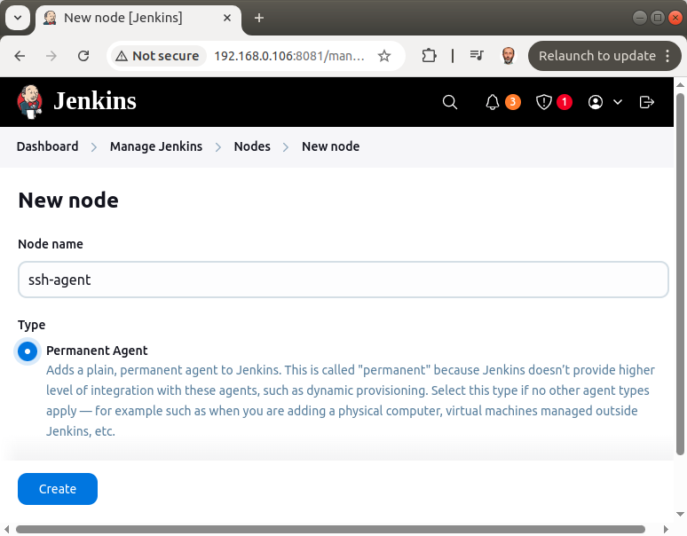

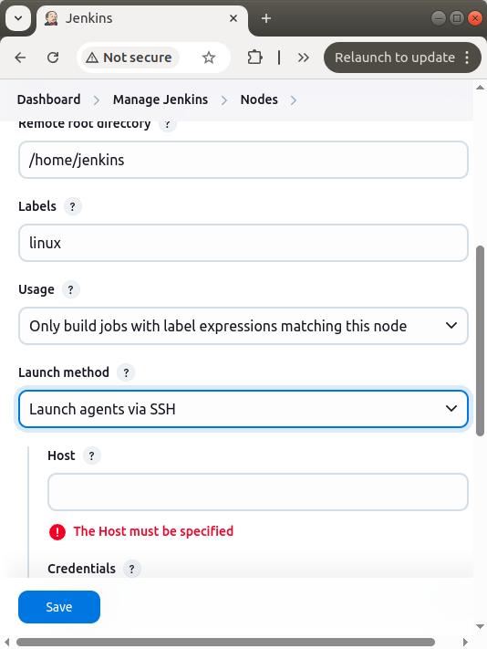

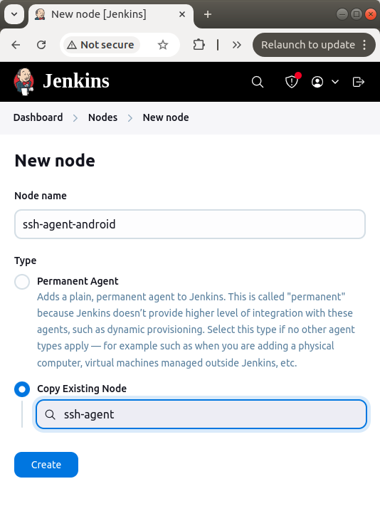

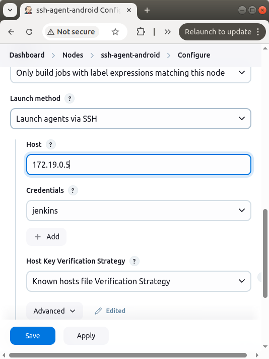

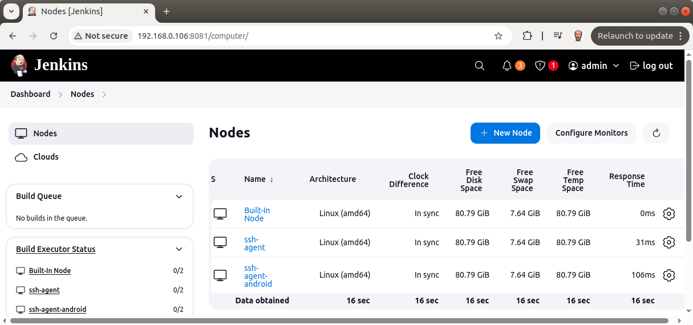

и гитсервера

New job APK_Jenkinsfiles

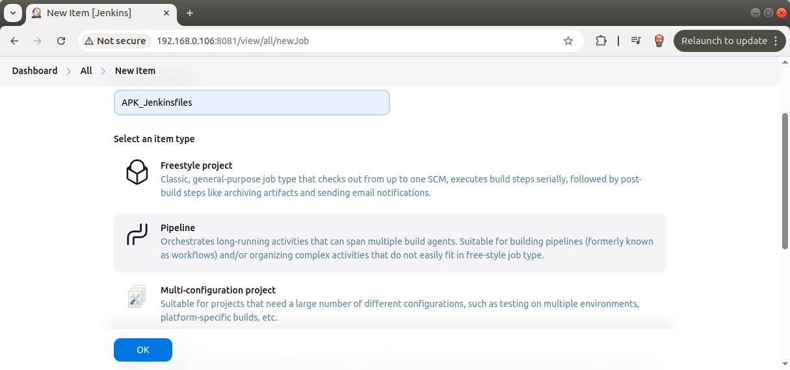

Now we create new pipeline using local git repo as source

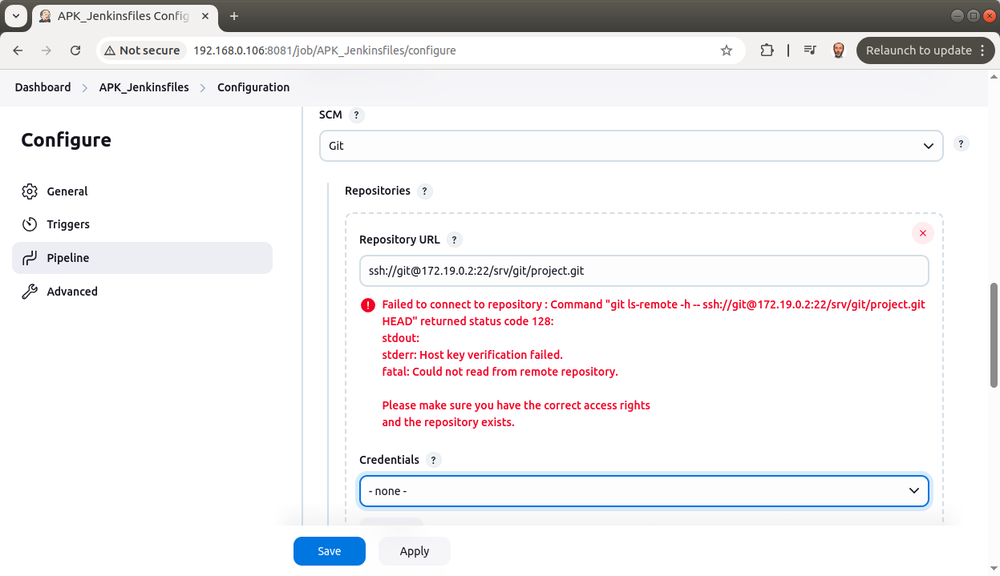

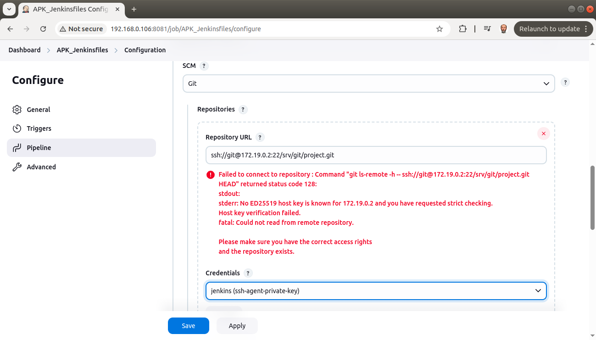

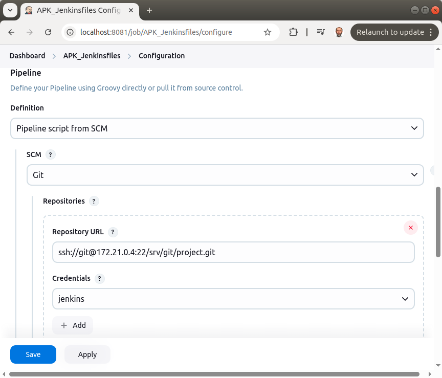

для аутентификации в папке

docker/ssh-agent

нужно сгенерировать или скопировать в эту папку ключи

```bash
    jenkins$ ls docker/ssh-agent/.ssh/
    id_rsa id_rsa.pub
```
у меня эти ключи сгенерированы для пользователя jenkins
